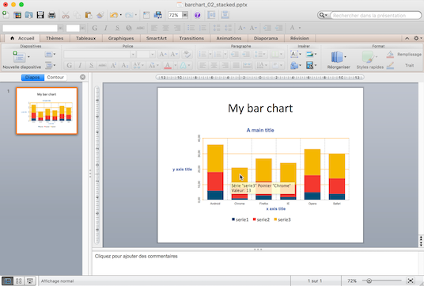

mschart R package
================

<!-- README.md is generated from README.Rmd. Please edit that file -->
[](https://travis-ci.org/ardata-fr/mschart) [](https://CRAN.R-project.org/package=mschart)  

The `mschart` package provides a framework for easily create charts for 'Microsoft PowerPoint' documents. It has to be used with package [`officer`](https://davidgohel.github.io/officer) that will produce the charts in new or existing PowerPoint or Word documents.



**The user documentation can be read [here](https://ardata-fr.github.io/mschart/articles/introduction.html).**

**Functions you should be aware of are documented [here](https://ardata-fr.github.io/mschart/reference/index.html).**

Installation
------------

You can install the package from github with:

``` r
# install.packages("devtools")
# devtools::install_github("ropensci/writexl")
# mschart depends on writexl which is provided by ropensci
devtools::install_github("ardata-fr/mschart")
```

Example
-------

This is a basic example which shows you how to create a line chart.

``` r
library(mschart)
library(officer)

linec <- ms_linechart(data = iris, x = "Sepal.Length",
                      y = "Sepal.Width", group = "Species")
linec <- chart_ax_y(linec, num_fmt = "0.00", rotation = -90)
```

Then use package `officer` to send the object as a chart.

``` r
doc <- read_pptx()
doc <- add_slide(doc, layout = "Title and Content", master = "Office Theme")
doc <- ph_with_chart(doc, chart = linec)

print(doc, target = "example.pptx")
```

At any moment, you can type `print(your_chart, preview = TRUE)` to preview the chart in a temporary PowerPoint file. This requires to have a PowerPoint Viewer installed on the machine.

Note
----

The project is in development, there will be more graphics later.
