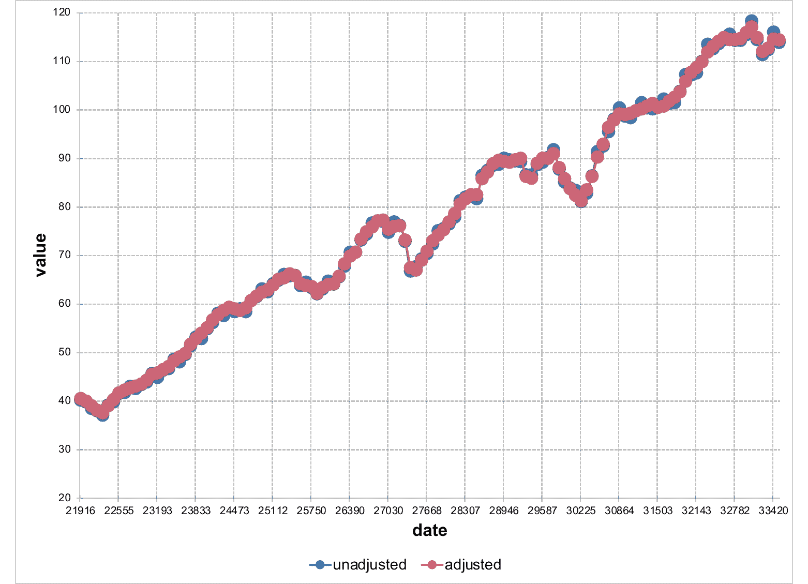

# X axis settings

Define settings for an x axis. S3 generic; the `default` method is
documented below. ChartEx charts have a leaner set of supported
options - see the package documentation.

## Usage

``` r
chart_ax_x(x, ...)

# Default S3 method
chart_ax_x(
  x,
  orientation,
  crosses,
  cross_between,
  major_tick_mark,
  minor_tick_mark,
  tick_label_pos,
  display,
  num_fmt,
  rotation,
  limit_min,
  limit_max,
  position,
  major_unit,
  minor_unit,
  major_time_unit,
  minor_time_unit,
  ...
)
```

## Arguments

- x:

  an `ms_chart` object.

- ...:

  arguments passed to S3 methods.

- orientation:

  axis orientation, one of 'maxMin', 'minMax'.

- crosses:

  specifies how the axis crosses the perpendicular axis, one of
  'autoZero', 'max', 'min'.

- cross_between:

  specifies how the value axis crosses the category axis between
  categories, one of 'between', 'midCat'.

- major_tick_mark, minor_tick_mark:

  tick marks position, one of 'cross', 'in', 'none', 'out'.

- tick_label_pos:

  ticks labels position, one of 'high', 'low', 'nextTo', 'none'.

- display:

  should the axis be displayed (a logical of length 1).

- num_fmt:

  number formatting. See the num_fmt section for more details.

- rotation:

  rotation angle. Value should be between `-360` and `360`.

- limit_min:

  minimum value on the axis. Date objects are also accepted and will be
  converted automatically.

- limit_max:

  maximum value on the axis. Date objects are also accepted and will be
  converted automatically.

- position:

  the value at which this axis crosses the perpendicular axis.

- major_unit:

  numeric, interval between major ticks and gridlines.

- minor_unit:

  numeric, interval between minor ticks and gridlines.

- major_time_unit:

  time unit for major ticks on date axes, one of `"days"`, `"months"`,
  `"years"`.

- minor_time_unit:

  time unit for minor ticks on date axes, one of `"days"`, `"months"`,
  `"years"`.

## Value

An `ms_chart` object.

## num_fmt

All `%` need to be doubled, `0%%` means "a number and percent symbol".

To my current knowledge, depending on the chart type and options, the
following values are not systematically used by office chart engine;
i.e. when chart pre-compute percentages, it seems using `0%%` will have
no effect.

- `General`: default value

- `0`: display the number with no decimal

- `0.00`: display the number with two decimals

- `0%%`: display as percentages

- `0.00%%`: display as percentages with two decimal places

- `#,##0`

- `#,##0.00`

- `0.00E+00`

- `# ?/?`

- `# ??/??`

- `mm-dd-yy`

- `d-mmm-yy`

- `d-mmm`

- `mmm-yy`

- `h:mm AM/PM`

- `h:mm:ss AM/PM`

- `h:mm`

- `h:mm:ss`

- `m/d/yy h:mm`

- `#,##0 ;(#,##0)`

- `#,##0 ;[Red](#,##0)`

- `#,##0.00;(#,##0.00)`

- `#,##0.00;[Red](#,##0.00)`

- `mm:ss`

- `[h]:mm:ss`

- `mmss.0`

- `##0.0E+0`

- `@`

## Illustrations



## See also

[`chart_ax_y()`](https://ardata-fr.github.io/mschart/dev/reference/chart_ax_y.md),
[`ms_areachart()`](https://ardata-fr.github.io/mschart/dev/reference/ms_areachart.md),
[`ms_barchart()`](https://ardata-fr.github.io/mschart/dev/reference/ms_barchart.md),
[`ms_scatterchart()`](https://ardata-fr.github.io/mschart/dev/reference/ms_scatterchart.md),
[`ms_linechart()`](https://ardata-fr.github.io/mschart/dev/reference/ms_linechart.md)

## Examples

``` r
library(mschart)

chart_01 <- ms_linechart(
  data = us_indus_prod,
  x = "date", y = "value",
  group = "type"
)

chart_01 <- chart_ax_y(x = chart_01, limit_min = 20, limit_max = 120)
chart_01
#> * 'ms_linechart' object
#> 
#> * original data [256,3] (sample):
#>         date       type value
#> 1 1960-01-01 unadjusted  40.2
#> 2 1960-04-01 unadjusted  39.8
#> 3 1960-07-01 unadjusted  38.5
#> 4 1960-10-01 unadjusted  38.0
#> 5 1961-01-01 unadjusted  37.1
#> 
#> * series data [128,3] (sample):
#>         date unadjusted adjusted
#> 1 1960-01-01       40.2     40.5
#> 2 1960-04-01       39.8     40.0
#> 3 1960-07-01       38.5     39.0
#> 4 1960-10-01       38.0     38.1
#> 5 1961-01-01       37.1     37.6

# control axis intervals
chart_01 <- chart_ax_x(chart_01,
  major_unit = 10, major_time_unit = "years"
)
chart_01 <- chart_ax_y(chart_01, major_unit = 20)
chart_01
#> * 'ms_linechart' object
#> 
#> * original data [256,3] (sample):
#>         date       type value
#> 1 1960-01-01 unadjusted  40.2
#> 2 1960-04-01 unadjusted  39.8
#> 3 1960-07-01 unadjusted  38.5
#> 4 1960-10-01 unadjusted  38.0
#> 5 1961-01-01 unadjusted  37.1
#> 
#> * series data [128,3] (sample):
#>         date unadjusted adjusted
#> 1 1960-01-01       40.2     40.5
#> 2 1960-04-01       39.8     40.0
#> 3 1960-07-01       38.5     39.0
#> 4 1960-10-01       38.0     38.1
#> 5 1961-01-01       37.1     37.6
```
