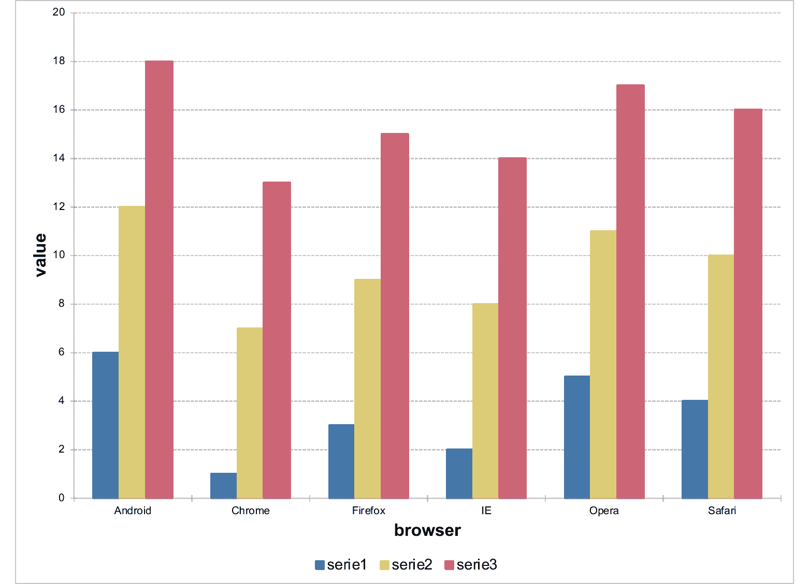
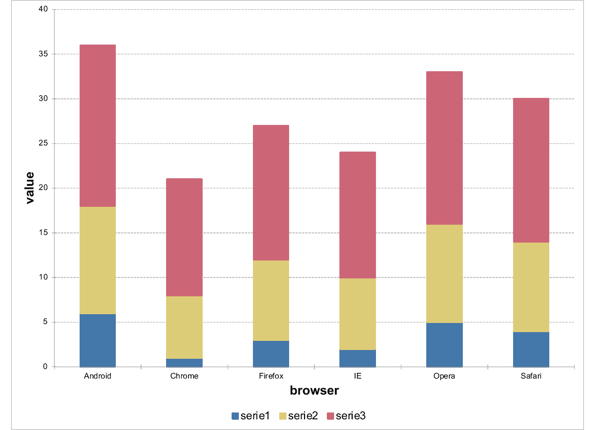
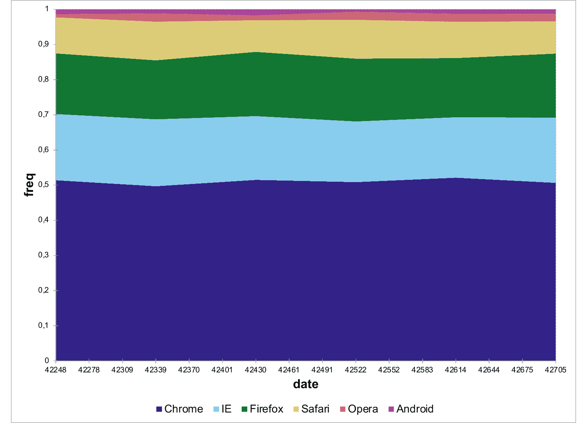

# Set chart options

Set chart properties.

## Usage

``` r
chart_settings(x, ...)

# S3 method for class 'ms_chart_ex'
chart_settings(x, ...)

# S3 method for class 'ms_barchart'
chart_settings(x, vary_colors, gap_width, dir, grouping, overlap, table, ...)

# S3 method for class 'ms_linechart'
chart_settings(x, vary_colors, style, grouping, table, ...)

# S3 method for class 'ms_areachart'
chart_settings(x, vary_colors, grouping, table, ...)

# S3 method for class 'ms_scatterchart'
chart_settings(x, vary_colors, style, ...)

# S3 method for class 'ms_stockchart'
chart_settings(
  x,
  vary_colors,
  table,
  hi_low_lines,
  up_bars_fill,
  up_bars_border,
  down_bars_fill,
  down_bars_border,
  ...
)

# S3 method for class 'ms_radarchart'
chart_settings(x, vary_colors, style, ...)

# S3 method for class 'ms_bubblechart'
chart_settings(x, vary_colors, bubble3D = FALSE, ...)

# S3 method for class 'ms_piechart'
chart_settings(x, vary_colors, hole_size, ...)

# S3 method for class 'ms_paretochart'
chart_settings(x, line, ...)

# S3 method for class 'ms_boxplotchart'
chart_settings(x, line, ...)
```

## Arguments

- x:

  an `ms_chart` object.

- ...:

  unused parameter

- vary_colors:

  if `TRUE`, each data point in a single series is displayed in a
  different color.

- gap_width:

  A gap appears between the bar or clustered bars for each category on a
  bar chart. The default width for this gap is 150 percent of the bar
  width. It can be set between 0 and 500 percent of the bar width.

- dir:

  the direction of the bars in the chart, value must be one of
  "horizontal" or "vertical".

- grouping:

  grouping of the series. For a barchart one of "percentStacked",
  "clustered", "standard" or "stacked". For a linechart or an areachart
  one of "percentStacked", "standard" or "stacked" ("clustered" is
  bar-only).

- overlap:

  In a bar chart having two or more series, the bars for each category
  are clustered together. By default, these bars are directly adjacent
  to each other. The bars can be made to overlap each other or have a
  space between them using the overlap property. Its values range
  between -100 and 100, representing the percentage of the bar width by
  which to overlap adjacent bars. A setting of -100 creates a gap of a
  full bar width and a setting of 100 causes all the bars in a category
  to be superimposed. The default value is 0.

- table:

  if `TRUE` set a table below the barchart.

- style:

  Style for the linechart or scatterchart type of markers. One of
  'none', 'line', 'lineMarker', 'marker', 'smooth', 'smoothMarker'.

- hi_low_lines:

  an
  [`officer::fp_border()`](https://davidgohel.github.io/officer/reference/fp_border.html)
  for the high-low lines. Set to `FALSE` to hide them.

- up_bars_fill:

  fill colour for up bars (OHLC only, close \> open).

- up_bars_border:

  an
  [`officer::fp_border()`](https://davidgohel.github.io/officer/reference/fp_border.html)
  for up bar borders.

- down_bars_fill:

  fill colour for down bars (OHLC only, close \< open).

- down_bars_border:

  an
  [`officer::fp_border()`](https://davidgohel.github.io/officer/reference/fp_border.html)
  for down bar borders.

- bubble3D:

  logical, use 3D effect for bubbles.

- hole_size:

  size of the hole in a doughnut chart, between 0 and 90 (percent of the
  radius). Default 0 produces a pie chart; values above 0 produce a
  doughnut chart.

- line:

  stroke for the cumulative percentage line. One of: `NULL` (default,
  matches Excel-native: theme `accent5` colour scaled to chart palette),
  `FALSE` to suppress the line override (line then depends on the
  chartstyle sidecar and may render as invisible), or an
  [`officer::fp_border()`](https://davidgohel.github.io/officer/reference/fp_border.html).

## Value

An `ms_chart` object.

## Methods (by class)

- `chart_settings(ms_chart_ex)`: fallback for chartEx types that expose
  no settings (funnel, histogram, sunburst, treemap, waterfall).
  Replaces the default `no applicable method` error with a discoverable
  message.

- `chart_settings(ms_barchart)`: barchart settings

- `chart_settings(ms_linechart)`: linechart settings

- `chart_settings(ms_areachart)`: areachart settings

- `chart_settings(ms_scatterchart)`: scatterchart settings

- `chart_settings(ms_stockchart)`: stockchart settings

- `chart_settings(ms_radarchart)`: radarchart settings

- `chart_settings(ms_bubblechart)`: bubblechart settings

- `chart_settings(ms_piechart)`: piechart settings

- `chart_settings(ms_paretochart)`: paretochart settings

- `chart_settings(ms_boxplotchart)`: boxplotchart settings

## Illustrations







## See also

[`ms_barchart()`](https://ardata-fr.github.io/mschart/dev/reference/ms_barchart.md),
[`ms_areachart()`](https://ardata-fr.github.io/mschart/dev/reference/ms_areachart.md),
[`ms_scatterchart()`](https://ardata-fr.github.io/mschart/dev/reference/ms_scatterchart.md),
[`ms_linechart()`](https://ardata-fr.github.io/mschart/dev/reference/ms_linechart.md)

## Examples

``` r
library(mschart)
library(officer)

chart_01 <- ms_barchart(
  data = browser_data, x = "browser",
  y = "value", group = "serie"
)
chart_01 <- chart_theme(chart_01,
  grid_major_line_x = fp_border(width = 0),
  grid_minor_line_x = fp_border(width = 0)
)

chart_02 <- chart_settings(
  x = chart_01,
  grouping = "stacked", overlap = 100
)


chart_03 <- ms_areachart(
  data = browser_ts, x = "date",
  y = "freq", group = "browser"
)
chart_03 <- chart_settings(chart_03,
  grouping = "percentStacked"
)
```
