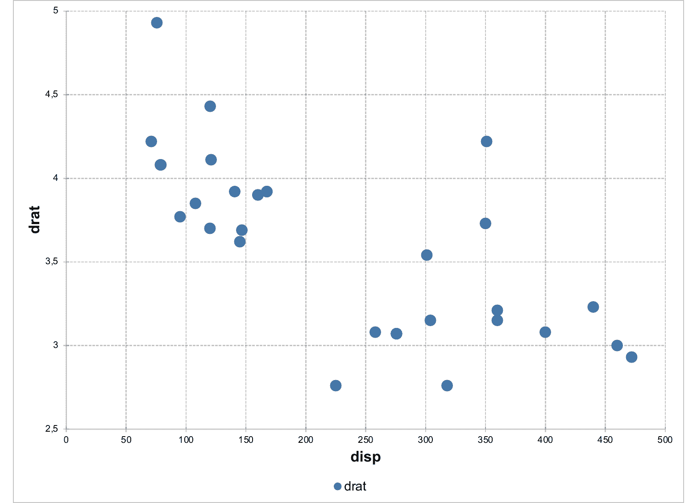
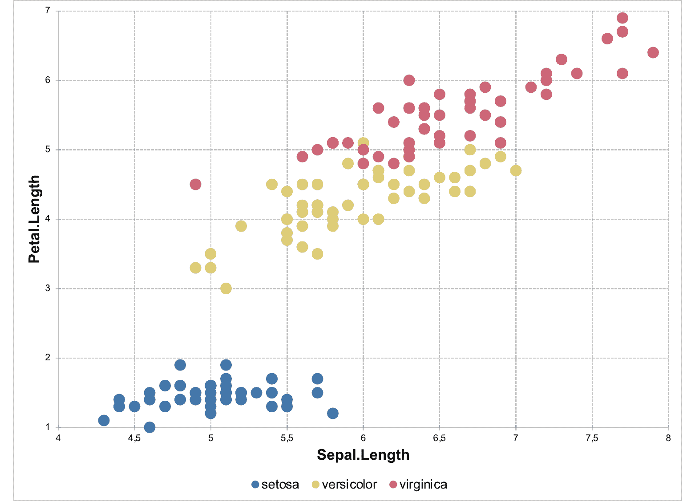

# Scatterchart object

Creation of a scatterchart object that can be inserted in a 'Microsoft'
document.

## Usage

``` r
ms_scatterchart(data, x, y, group = NULL, labels = NULL, asis = FALSE)
```

## Arguments

- data:

  a data.frame

- x:

  column name for x values.

- y:

  column name for y values.

- group:

  grouping column name used to split data into series. Optional.

- labels:

  column names of columns to be used as custom data labels displayed
  next to data points (not axis labels). Optional. If more than one name
  is provided, only the first one will be used as a label, but all
  labels (transposed if a group is used) will be available in the Excel
  file associated with the chart.

- asis:

  logical parameter defaulting to FALSE. When FALSE, the data is
  reshaped internally so that each series becomes a separate column.
  When TRUE, the data is used as-is and must already have one column for
  categories and one column per series, and `y` accepts a vector of
  series column names. `asis` describes the *input shape* read by the
  constructor. Not to be confused with the `write_data` argument of
  [`sheet_add_drawing.ms_chart()`](https://ardata-fr.github.io/mschart/dev/reference/sheet_add_drawing.ms_chart.md),
  which controls whether `mschart` writes the chart's data into an Excel
  sheet at embed time. The two are independent.

## Value

An `ms_chart` object.

## Illustrations





## See also

[`chart_settings()`](https://ardata-fr.github.io/mschart/dev/reference/chart_settings.md),
[`chart_ax_x()`](https://ardata-fr.github.io/mschart/dev/reference/chart_ax_x.md),
[`chart_ax_y()`](https://ardata-fr.github.io/mschart/dev/reference/chart_ax_y.md),
[`chart_data_labels()`](https://ardata-fr.github.io/mschart/dev/reference/chart_data_labels.md),
[`chart_theme()`](https://ardata-fr.github.io/mschart/dev/reference/set_theme.md),
[`chart_labels()`](https://ardata-fr.github.io/mschart/dev/reference/chart_labels.md)

Other 'Office' chart objects:
[`ms_areachart()`](https://ardata-fr.github.io/mschart/dev/reference/ms_areachart.md),
[`ms_barchart()`](https://ardata-fr.github.io/mschart/dev/reference/ms_barchart.md),
[`ms_boxplotchart()`](https://ardata-fr.github.io/mschart/dev/reference/ms_boxplotchart.md),
[`ms_bubblechart()`](https://ardata-fr.github.io/mschart/dev/reference/ms_bubblechart.md),
[`ms_chart_combine()`](https://ardata-fr.github.io/mschart/dev/reference/ms_chart_combine.md),
[`ms_funnelchart()`](https://ardata-fr.github.io/mschart/dev/reference/ms_funnelchart.md),
[`ms_histogramchart()`](https://ardata-fr.github.io/mschart/dev/reference/ms_histogramchart.md),
[`ms_linechart()`](https://ardata-fr.github.io/mschart/dev/reference/ms_linechart.md),
[`ms_paretochart()`](https://ardata-fr.github.io/mschart/dev/reference/ms_paretochart.md),
[`ms_piechart()`](https://ardata-fr.github.io/mschart/dev/reference/ms_piechart.md),
[`ms_radarchart()`](https://ardata-fr.github.io/mschart/dev/reference/ms_radarchart.md),
[`ms_stockchart()`](https://ardata-fr.github.io/mschart/dev/reference/ms_stockchart.md),
[`ms_sunburstchart()`](https://ardata-fr.github.io/mschart/dev/reference/ms_sunburstchart.md),
[`ms_treemapchart()`](https://ardata-fr.github.io/mschart/dev/reference/ms_treemapchart.md),
[`ms_waterfallchart()`](https://ardata-fr.github.io/mschart/dev/reference/ms_waterfallchart.md)

## Examples

``` r
library(officer)
# example chart_01 -------
chart_01 <- ms_scatterchart(
  data = mtcars, x = "disp",
  y = "drat"
)
chart_01 <- chart_settings(chart_01, scatterstyle = "marker")


# example chart_02 -------
chart_02 <- ms_scatterchart(
  data = iris, x = "Sepal.Length",
  y = "Petal.Length", group = "Species"
)
chart_02 <- chart_settings(chart_02, scatterstyle = "marker")
```
