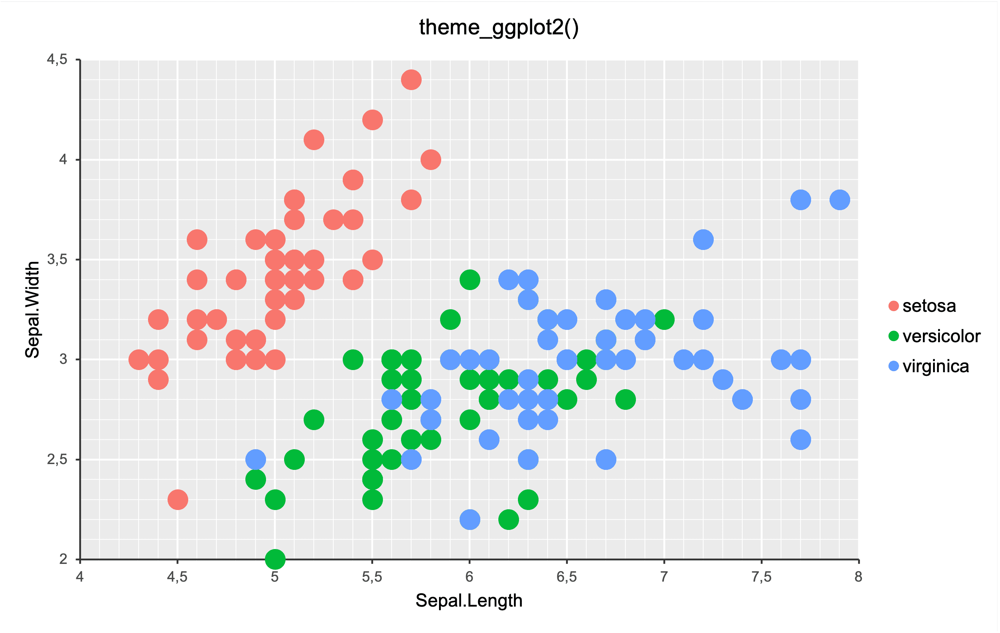

# Apply ggplot2 theme

A theme that approximates the style of ggplot2::theme_grey.

## Usage

``` r
theme_ggplot2(x, base_size = 11, base_family = "Arial")
```

## Arguments

- x:

  a mschart object

- base_size:

  base font size

- base_family:

  font family

## Value

a mschart object

## theme_ggplot2()



## Examples

``` r
p <- ms_scatterchart(
  data = iris, x = "Sepal.Length",
  y = "Sepal.Width", group = "Species"
)

p <- theme_ggplot2(p)
p <- chart_fill_ggplot2(p)
```
