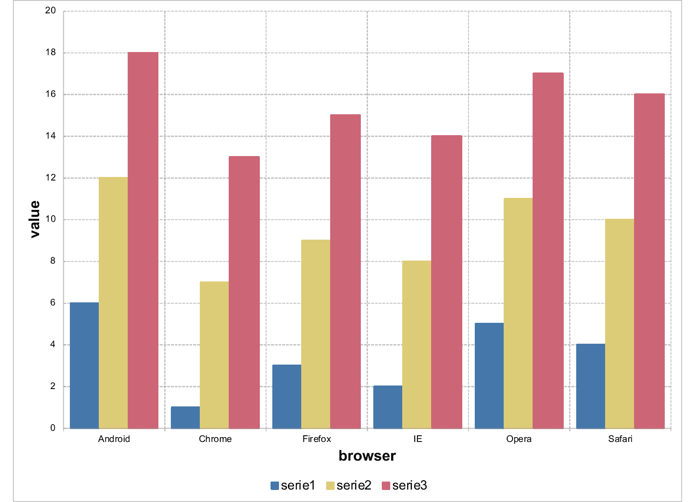
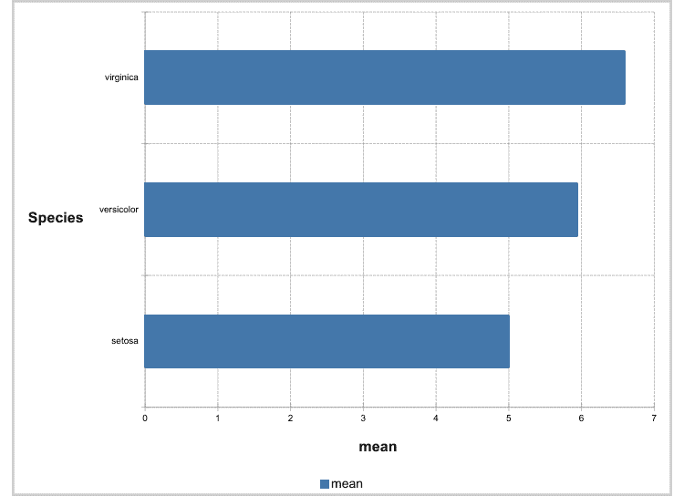
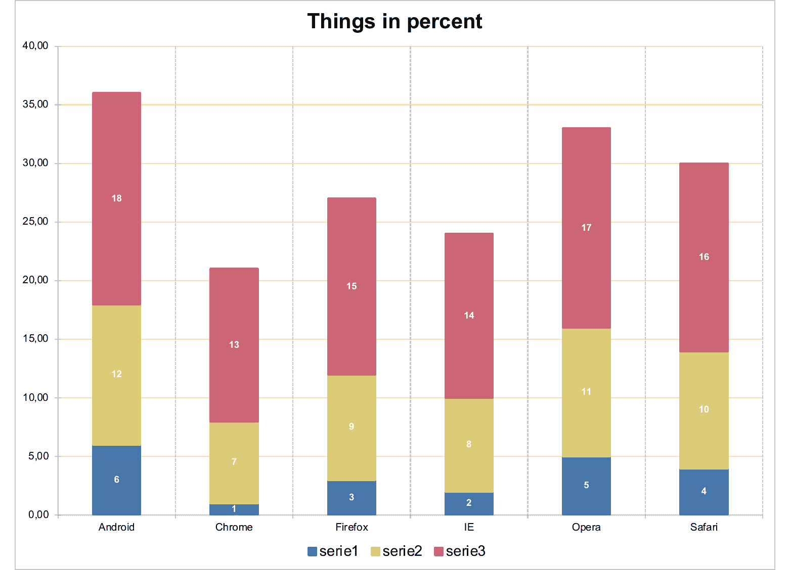
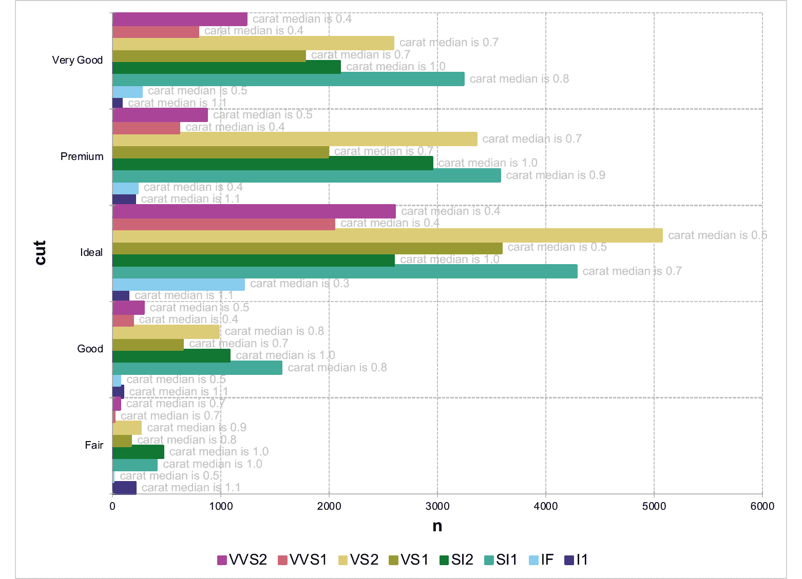
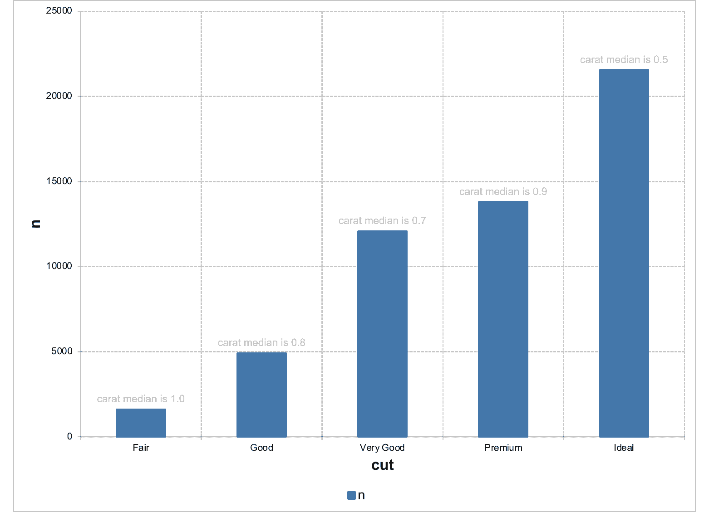
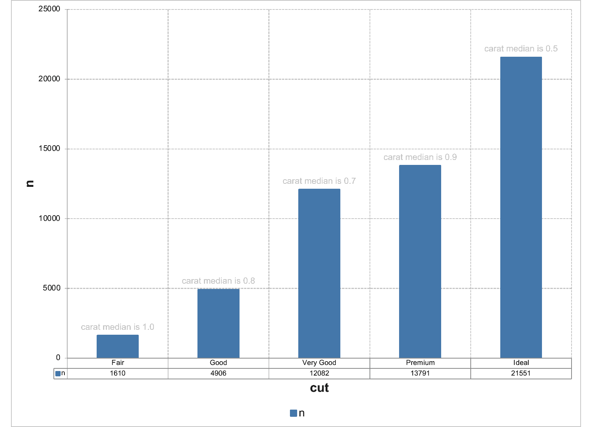

# Barchart object

Creation of a barchart object that can be inserted in a 'Microsoft'
document.

Bar charts illustrate comparisons among individual items. In a bar
chart, the categories are typically organized along the vertical axis,
and the values along the horizontal axis.

Consider using a bar chart when:

- The axis labels are long.

- The values that are shown are durations.

## Usage

``` r
ms_barchart(data, x, y, group = NULL, labels = NULL, asis = FALSE)
```

## Arguments

- data:

  a data.frame

- x:

  column name for x values.

- y:

  column name for y values.

- group:

  grouping column name used to split data into series. Optional.

- labels:

  column names of columns to be used as custom data labels displayed
  next to data points (not axis labels). Optional. If more than one name
  is provided, only the first one will be used as a label, but all
  labels (transposed if a group is used) will be available in the Excel
  file associated with the chart.

- asis:

  logical parameter defaulting to FALSE. When FALSE, the data is
  reshaped internally so that each series becomes a separate column.
  When TRUE, the data is used as-is and must already have one column for
  categories and one column per series, and `y` accepts a vector of
  series column names. `asis` describes the *input shape* read by the
  constructor. Not to be confused with the `write_data` argument of
  [`sheet_add_drawing.ms_chart()`](https://ardata-fr.github.io/mschart/reference/sheet_add_drawing.ms_chart.md),
  which controls whether `mschart` writes the chart's data into an Excel
  sheet at embed time. The two are independent.

## Value

An `ms_chart` object.

## Illustrations













## See also

[`chart_settings()`](https://ardata-fr.github.io/mschart/reference/chart_settings.md),
[`chart_ax_x()`](https://ardata-fr.github.io/mschart/reference/chart_ax_x.md),
[`chart_ax_y()`](https://ardata-fr.github.io/mschart/reference/chart_ax_y.md),
[`chart_data_labels()`](https://ardata-fr.github.io/mschart/reference/chart_data_labels.md),
[`chart_theme()`](https://ardata-fr.github.io/mschart/reference/set_theme.md),
[`chart_labels()`](https://ardata-fr.github.io/mschart/reference/chart_labels.md)

Other 'Office' chart objects:
[`ms_areachart()`](https://ardata-fr.github.io/mschart/reference/ms_areachart.md),
[`ms_boxplotchart()`](https://ardata-fr.github.io/mschart/reference/ms_boxplotchart.md),
[`ms_bubblechart()`](https://ardata-fr.github.io/mschart/reference/ms_bubblechart.md),
[`ms_chart_combine()`](https://ardata-fr.github.io/mschart/reference/ms_chart_combine.md),
[`ms_funnelchart()`](https://ardata-fr.github.io/mschart/reference/ms_funnelchart.md),
[`ms_histogramchart()`](https://ardata-fr.github.io/mschart/reference/ms_histogramchart.md),
[`ms_linechart()`](https://ardata-fr.github.io/mschart/reference/ms_linechart.md),
[`ms_paretochart()`](https://ardata-fr.github.io/mschart/reference/ms_paretochart.md),
[`ms_piechart()`](https://ardata-fr.github.io/mschart/reference/ms_piechart.md),
[`ms_radarchart()`](https://ardata-fr.github.io/mschart/reference/ms_radarchart.md),
[`ms_scatterchart()`](https://ardata-fr.github.io/mschart/reference/ms_scatterchart.md),
[`ms_stockchart()`](https://ardata-fr.github.io/mschart/reference/ms_stockchart.md),
[`ms_sunburstchart()`](https://ardata-fr.github.io/mschart/reference/ms_sunburstchart.md),
[`ms_treemapchart()`](https://ardata-fr.github.io/mschart/reference/ms_treemapchart.md),
[`ms_waterfallchart()`](https://ardata-fr.github.io/mschart/reference/ms_waterfallchart.md)

## Examples

``` r
library(officer)
library(mschart)
library(officer)


# example chart 01 -------

chart_01 <- ms_barchart(
  data = browser_data, x = "browser",
  y = "value", group = "serie"
)
chart_01 <- chart_settings(
  x = chart_01, dir = "vertical",
  grouping = "clustered", gap_width = 50
)
chart_01 <- chart_ax_x(
  x = chart_01, cross_between = "between",
  major_tick_mark = "out"
)
chart_01 <- chart_ax_y(
  x = chart_01, cross_between = "midCat",
  major_tick_mark = "in"
)
# print(chart_01, preview = TRUE)


# example chart 02 -------
dat <- data.frame(
  Species = factor(c("setosa", "versicolor", "virginica"),
    levels = c("setosa", "versicolor", "virginica")
  ),
  mean = c(5.006, 5.936, 6.588)
)
chart_02 <- ms_barchart(data = dat, x = "Species", y = "mean")
chart_02 <- chart_settings(x = chart_02, dir = "horizontal")
chart_02 <- chart_theme(x = chart_02, title_x_rot = 270, title_y_rot = 0)
# print(chart_02, preview = TRUE)


# example chart 03 -------

mytheme <- mschart_theme(
  axis_title_x = fp_text(color = "gray", font.size = 20, bold = TRUE),
  axis_title_y = fp_text(color = "gray", font.size = 20, italic = TRUE),
  grid_major_line_y = fp_border(width = 1, color = "wheat"),
  axis_ticks_y = fp_border(width = 1, color = "gray")
)

chart_03 <- ms_barchart(
  data = browser_data, x = "browser",
  y = "value", group = "serie"
)
chart_03 <- chart_settings(chart_03,
  grouping = "stacked",
  gap_width = 150, overlap = 100
)
chart_03 <- chart_ax_x(chart_03,
  cross_between = "between",
  major_tick_mark = "out", minor_tick_mark = "none"
)
chart_03 <- chart_ax_y(chart_03,
  num_fmt = "0.00",
  minor_tick_mark = "none"
)
chart_03 <- set_theme(chart_03, mytheme)
chart_03 <- chart_labels(x = chart_03, title = "Things in percent")
chart_03 <- chart_data_labels(chart_03,
  position = "ctr",
  show_val = TRUE
)
chart_03 <- chart_labels_text(chart_03,
  fp_text(color = "white", bold = TRUE, font.size = 9)
)
chart_03 <- chart_data_fill(chart_03,
  values = c(
    serie1 = "#4477AA",
    serie2 = "#CC6677",
    serie3 = "#DDCC77"
  )
)
chart_03 <- chart_data_stroke(chart_03,
  values = c(
    serie1 = "#223B55",
    serie2 = "#66333C",
    serie3 = "#6F663C"
  )
)
chart_03 <- chart_data_line_width(chart_03,
  values = c(serie1 = 2, serie2 = 2, serie3 = 2)
)
# print(chart_03, preview = TRUE)

# example chart 04 -------

dat_groups <-
  data.frame(
    cut = c(
      "Fair", "Fair", "Fair", "Fair", "Fair",
      "Fair", "Fair", "Fair", "Good", "Good", "Good", "Good", "Good",
      "Good", "Good", "Good", "Very Good", "Very Good", "Very Good",
      "Very Good", "Very Good", "Very Good", "Very Good", "Very Good",
      "Premium", "Premium", "Premium", "Premium", "Premium",
      "Premium", "Premium", "Premium", "Ideal", "Ideal", "Ideal", "Ideal",
      "Ideal", "Ideal", "Ideal", "Ideal"
    ),
    clarity = c(
      "I1", "SI2", "SI1", "VS2", "VS1", "VVS2",
      "VVS1", "IF", "I1", "SI2", "SI1", "VS2", "VS1", "VVS2", "VVS1",
      "IF", "I1", "SI2", "SI1", "VS2", "VS1", "VVS2", "VVS1", "IF",
      "I1", "SI2", "SI1", "VS2", "VS1", "VVS2", "VVS1", "IF", "I1",
      "SI2", "SI1", "VS2", "VS1", "VVS2", "VVS1", "IF"
    ),
    carat = c(
      1.065, 1.01, 0.98, 0.9, 0.77, 0.7, 0.7,
      0.47, 1.07, 1, 0.79, 0.82, 0.7, 0.505, 0.4, 0.46, 1.145, 1.01,
      0.77, 0.71, 0.7, 0.4, 0.36, 0.495, 1.11, 1.04, 0.9, 0.72, 0.7,
      0.455, 0.4, 0.36, 1.13, 1, 0.71, 0.53, 0.53, 0.44, 0.4, 0.34
    ),
    n = c(
      210L, 466L, 408L, 261L, 170L, 69L, 17L, 9L,
      96L, 1081L, 1560L, 978L, 648L, 286L, 186L, 71L, 84L, 2100L,
      3240L, 2591L, 1775L, 1235L, 789L, 268L, 205L, 2949L, 3575L, 3357L,
      1989L, 870L, 616L, 230L, 146L, 2598L, 4282L, 5071L, 3589L,
      2606L, 2047L, 1212L
    )
  )

dat_groups$label <- sprintf(
  "carat median is %.01f",
  dat_groups$carat
)
dat_groups
#>          cut clarity carat    n               label
#> 1       Fair      I1 1.065  210 carat median is 1.1
#> 2       Fair     SI2 1.010  466 carat median is 1.0
#> 3       Fair     SI1 0.980  408 carat median is 1.0
#> 4       Fair     VS2 0.900  261 carat median is 0.9
#> 5       Fair     VS1 0.770  170 carat median is 0.8
#> 6       Fair    VVS2 0.700   69 carat median is 0.7
#> 7       Fair    VVS1 0.700   17 carat median is 0.7
#> 8       Fair      IF 0.470    9 carat median is 0.5
#> 9       Good      I1 1.070   96 carat median is 1.1
#> 10      Good     SI2 1.000 1081 carat median is 1.0
#> 11      Good     SI1 0.790 1560 carat median is 0.8
#> 12      Good     VS2 0.820  978 carat median is 0.8
#> 13      Good     VS1 0.700  648 carat median is 0.7
#> 14      Good    VVS2 0.505  286 carat median is 0.5
#> 15      Good    VVS1 0.400  186 carat median is 0.4
#> 16      Good      IF 0.460   71 carat median is 0.5
#> 17 Very Good      I1 1.145   84 carat median is 1.1
#> 18 Very Good     SI2 1.010 2100 carat median is 1.0
#> 19 Very Good     SI1 0.770 3240 carat median is 0.8
#> 20 Very Good     VS2 0.710 2591 carat median is 0.7
#> 21 Very Good     VS1 0.700 1775 carat median is 0.7
#> 22 Very Good    VVS2 0.400 1235 carat median is 0.4
#> 23 Very Good    VVS1 0.360  789 carat median is 0.4
#> 24 Very Good      IF 0.495  268 carat median is 0.5
#> 25   Premium      I1 1.110  205 carat median is 1.1
#> 26   Premium     SI2 1.040 2949 carat median is 1.0
#> 27   Premium     SI1 0.900 3575 carat median is 0.9
#> 28   Premium     VS2 0.720 3357 carat median is 0.7
#> 29   Premium     VS1 0.700 1989 carat median is 0.7
#> 30   Premium    VVS2 0.455  870 carat median is 0.5
#> 31   Premium    VVS1 0.400  616 carat median is 0.4
#> 32   Premium      IF 0.360  230 carat median is 0.4
#> 33     Ideal      I1 1.130  146 carat median is 1.1
#> 34     Ideal     SI2 1.000 2598 carat median is 1.0
#> 35     Ideal     SI1 0.710 4282 carat median is 0.7
#> 36     Ideal     VS2 0.530 5071 carat median is 0.5
#> 37     Ideal     VS1 0.530 3589 carat median is 0.5
#> 38     Ideal    VVS2 0.440 2606 carat median is 0.4
#> 39     Ideal    VVS1 0.400 2047 carat median is 0.4
#> 40     Ideal      IF 0.340 1212 carat median is 0.3

text_prop <- fp_text(font.size = 11, color = "gray")

chart_04 <- ms_barchart(
  data = dat_groups, x = "cut",
  labels = "label", y = "n", group = "clarity"
)
chart_04 <- chart_settings(chart_04,
  grouping = "clustered", dir = "horizontal",
  gap_width = 0
)
chart_04 <- chart_data_labels(chart_04, position = "outEnd")
chart_04 <- chart_labels_text(chart_04, text_prop)
chart_04 <- chart_theme(chart_04, title_x_rot = 270, title_y_rot = 0)
# print(chart_04, preview = TRUE)

# example chart 05 -------

dat_no_group <- data.frame(
  stringsAsFactors = FALSE,
  cut = c("Fair", "Good", "Very Good", "Premium", "Ideal"),
  carat = c(1, 0.82, 0.71, 0.86, 0.54),
  n = c(1610L, 4906L, 12082L, 13791L, 21551L),
  label = c(
    "carat median is 1.0",
    "carat median is 0.8", "carat median is 0.7",
    "carat median is 0.9", "carat median is 0.5"
  )
)
chart_05 <- ms_barchart(
  data = dat_no_group,
  x = "cut", labels = "label", y = "n"
)
chart_05 <- chart_settings(chart_05,
  grouping = "clustered"
)
chart_05 <- chart_data_labels(chart_05, position = "outEnd")
chart_05 <- chart_labels_text(chart_05, text_prop)
# print(chart_05, preview = TRUE)

# example chart 06 -------
chart_06 <- ms_barchart(
  data = dat_no_group,
  x = "cut", labels = "label", y = "n"
)
chart_06 <- chart_settings(chart_06,
  grouping = "clustered", table = TRUE
)
chart_06 <- chart_data_labels(chart_06, position = "outEnd")
chart_06 <- chart_labels_text(chart_06, text_prop)
# print(chart_06, preview = TRUE)


# example chart 07 -------
# Series order (and therefore legend order) follows the levels of
# the `group` factor. Convert the column to a factor with the desired
# level order before passing it to ms_barchart().
ordered_data <- browser_data
ordered_data$serie <- factor(ordered_data$serie,
  levels = c("serie3", "serie1", "serie2")
)
chart_07 <- ms_barchart(
  data = ordered_data, x = "browser",
  y = "value", group = "serie"
)
chart_07 <- chart_labels(chart_07,
  title = "Series and legend ordered via factor levels"
)
# print(chart_07, preview = TRUE)

# example chart 08 -------
# Wide-format input: each series is its own column. Pass the series
# column names as a vector in `y` and set `asis = TRUE`.
browser_wide <- data.frame(
  browser = unique(browser_data$browser),
  serie1  = browser_data$value[browser_data$serie == "serie1"],
  serie2  = browser_data$value[browser_data$serie == "serie2"],
  serie3  = browser_data$value[browser_data$serie == "serie3"]
)
chart_08 <- ms_barchart(
  data = browser_wide,
  x = "browser",
  y = c("serie1", "serie2", "serie3"),
  asis = TRUE
)
# print(chart_08, preview = TRUE)
```
